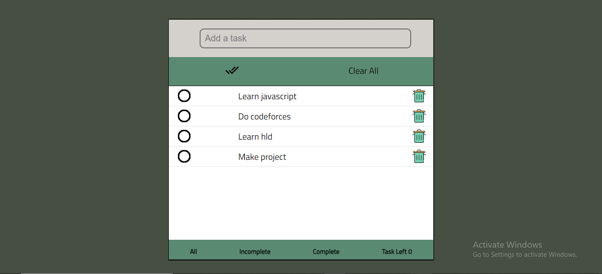
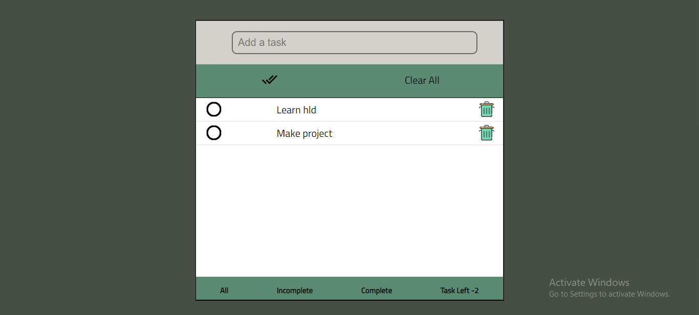
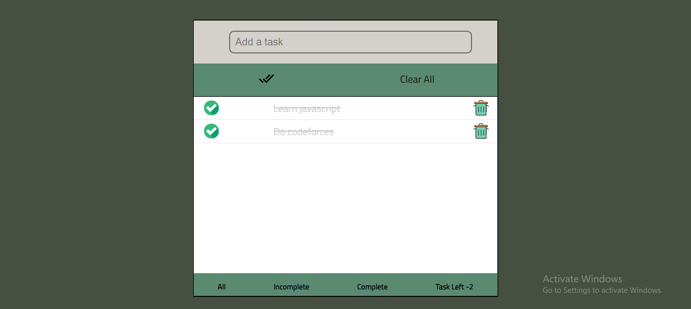

# Daily-Manager
[**Visit Daily Manager App**](https://dailymanger.netlify.app/)  

#### User can
- Create a todo task.
- Delete a todo task.
- See the added todo tasks.
- Complete a todo task.
- Complete all todo task.
- Delete completed todo tasks.
- Filter todo tasks.
- See the number of todo tasks.

#### Technical Exposure
- HTML
- CSS
- Vanilla JavaScript

#### Screenshot

